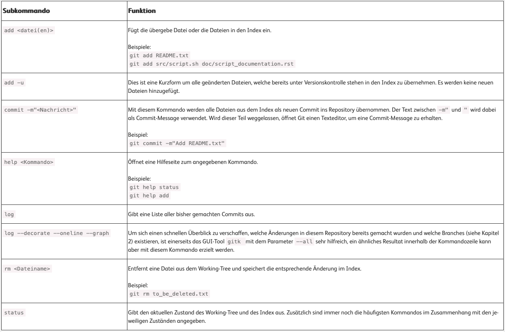
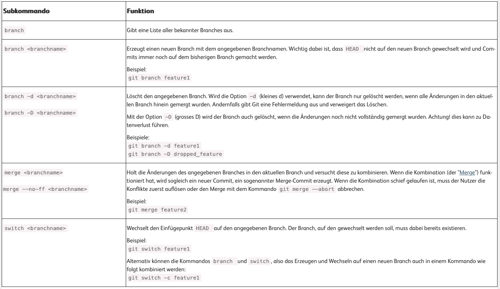
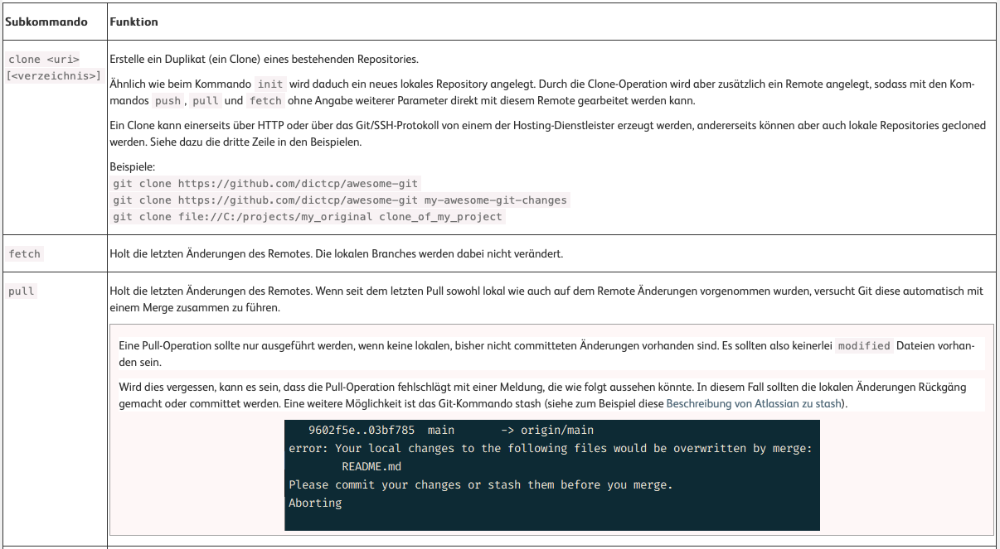
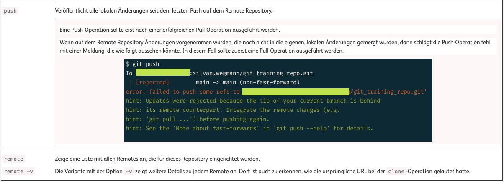

# Terminal Commands

`cd <Verzeichnisname>` Zum Verzeichnis

`cd ..` Zum Übergeordneten Verzeichnis

`cd ~` Zum Home Verzeichnis

`cd <Verzeichnisname1>/<Verzeichnisname2>` In mehrere Verzeichnisse auf einmal wechseln

`mkdir <Verzeichnisname>` Neues Verzeichnis anlegen

`ls` Verzeichnisinhalt ansehen

`ls -l` Verzeichnisinhalt ansehen

`rm <Dateiname>` Datei Loschen

`rm <Dateiname1> <Dateiname2> <Dateiname3>` Mehrere Dateien Loschen

`rm -r <Verzeichnisname>` Verzeichnis Loschen

`cp <Dateiname> <Zielverzeichnis>` Datei in ein Anderes Verzeichnis Kopieren

`cp <Dateiname1> <Dateiname2> ... <Zielverzeichnis>` Mehrere Dateien in ein anderes Verzeichnis Kopieren

`mv <AlterDateiname> <NeuerDateiname>` Datei umbenennen

`touch <Dateiname>.txt` Neue Datei erstellen 

`open <Dateiname>.txt` Öffne Datei

`open .` Open current directory

`nano <Dateiname>` Edit txt file or smth


Pull all Gitrepos the latest changes

```shell
for d in */ ; do (cd "$d" && git pull); done
```

## Git









Files umbenennen: `git mv old_filename new_filename`